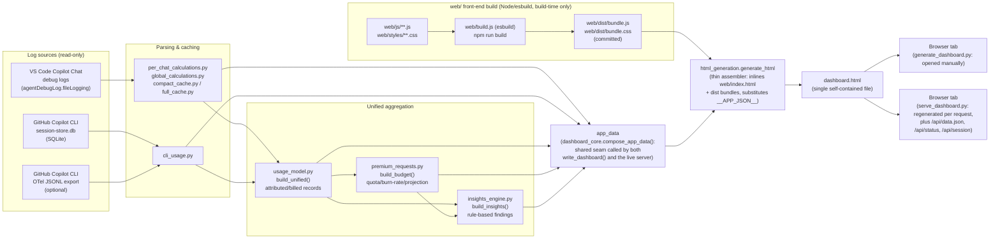

# Copilot Token Dashboard

A self-contained HTML dashboard for exploring your own GitHub Copilot usage — both **VS Code Copilot Chat** debug logs and the **GitHub Copilot CLI**'s local `session-store.db`. It parses whatever local data is available and renders a single-file browser UI, with no external service and no data leaving your machine.

- An **Overview** tab (the default landing tab): unified Chat+CLI KPIs, a premium-request quota gauge with burn-rate/end-of-month projection, cost/token trend charts, a Chat-vs-CLI split, top models/repositories/hosts, and top recommendations.
- A global sticky **filter bar** — source (All / Chat / CLI), period (Today / 7 days / 30 days / This month / All time / custom date range), and an Attributed/Billed token-mode toggle — honoured by every tab, including the CLI tab.
- **Deep links**: the active tab, subtab, filters, period, and token mode are encoded in the URL hash and restored on load, so any view can be bookmarked or shared.
- One row per chat/session, with source-server IP shown and searchable on each chat; expandable timelines showing user messages, tool calls, and model calls.
- A `GenAI details` modal with full prompt/input/output context, and a context-window breakdown split into system instructions, tool definitions, messages, tool results, and other prompt content.
- API-style cost estimation using model pricing, plus GitHub Copilot premium-request accounting (quota, burn rate, projection, and warn/critical alerts).
- A deterministic, rule-based **insights engine** — no LLM calls — surfacing findings with severity, supporting evidence, and estimated savings in both dollars and premium requests.
- Analysis views for models, tools, files, insights, monthly trends, and telemetry.
- Per-file timeline graphs for estimated token/cost impact over time.
- A separate **CLI** tab covering GitHub Copilot CLI sessions, with an OTel status panel and optional OpenTelemetry-based per-tool enrichment.
- Light/dark **theme toggle** (persisted to `localStorage`), and **CSV export** on tables alongside the existing JSON export.
- `--anonymize` support to hash host/developer identifiers before they reach the generated HTML, for sharing dashboards or screenshots externally.

## Table of contents

- [What's new](#whats-new)
- [Quickstart](#quickstart)
- [Concepts](#concepts)
- [Setting up VS Code Copilot Chat logging](#setting-up-vs-code-copilot-chat-logging)
- [Setting up GitHub Copilot CLI tracking](#setting-up-github-copilot-cli-tracking)
- [Configuration reference](#configuration-reference)
- [Architecture](#architecture)
- [Troubleshooting](#troubleshooting)
- [Development](#development)
- [Caveats](#caveats)
- [Sharing, persistence, and remote aggregation](#sharing-persistence-and-remote-aggregation)

## What's new

This is a summary for returning users; everything here is described in full in the relevant section below.

- **Overview tab** is now the default landing tab, combining Chat + CLI KPIs, a premium-request quota gauge, cost/token trends, and top recommendations in one place.
- **Premium-request tracking** (`premium_requests.py`): per-model multipliers, plan allowances, a monthly quota gauge, burn-rate/end-of-month projection, and warn/critical alerts — configurable via `--plan`, `--premium-quota`, `--premium-config`, or `~/.copilot-dashboard/premium.json`.
- **Insights engine** (`insights_engine.py`): deterministic, rule-based recommendations (never an LLM) with severity, evidence, and estimated savings. Findings are tagged `chat` / `cli` / `both` and filtered by the global source filter — Overview's "Top recommendations" and Analysis → Insights therefore always agree; only severity and "savings only" are Insights-local controls. The period filter does not apply to recommendations: the rules run once over the whole dataset at generation time (see [The insights engine](#the-insights-engine)).
- **Unified usage model** (`usage_model.py`): one canonical record shape behind every cross-source aggregate — see [Concepts](#concepts).
- **Global filter bar + deep links**: source/period/token-mode filters apply everywhere and round-trip through the URL hash.
- **`--anonymize`**: replace host/IP/developer identifiers with stable pseudonyms before they reach the HTML.
- **OTel status panel** in the CLI tab: shows whether CLI OpenTelemetry is active, which files were parsed, span/session-join counts, and copy-pasteable setup commands when it's off.
- **Theme toggle** and **CSV export** on tables.
- **Server**: input-fingerprint-keyed HTML caching (a cache hit is roughly 30x faster than a rebuild), `ETag`/`Last-Modified`/`304` conditional responses, and new `/api/data.json` / `/api/status` / `/api/session` endpoints — see [Configuration reference](#configuration-reference) and [Quickstart](#quickstart).
- **`web/` front-end rewrite**: the dashboard's HTML/CSS/JS now lives in a real source tree (`web/`) bundled by esbuild, rather than as one large inline `<script>` inside `html_generation.py` — see [Development](#development).
- **Tests**: the `pytest` suite has grown to ~129 tests, including full server-integration coverage (`tests/test_server_integration.py`) and a `web/` assembly contract test (`tests/test_web_assembly.py`).

## Quickstart

Requirements: Python 3, and the `zstd` command-line tool (some debug-log entries are zstd-compressed). Windows uses the `python` launcher; Linux and macOS use `python3`. Nothing else is required to try it — GitHub Copilot CLI usage is picked up automatically from `~/.copilot/session-store.db` if it exists, and VS Code Chat logs require a one-time settings change (see [below](#setting-up-vs-code-copilot-chat-logging)).

### Windows (PowerShell)

```powershell
# install zstd if you don't have it
winget install Meta.Zstandard

# generate a static HTML file (written to the system temp dir by default)
python generate_dashboard.py

# OR run the live server and open it in a browser
python serve_dashboard.py --host 127.0.0.1 --port 8765
# then browse to http://127.0.0.1:8765/dashboard.html
```

### Linux

```bash
sudo apt install zstd   # Debian/Ubuntu; use your distro's package manager otherwise

python3 generate_dashboard.py

python3 serve_dashboard.py --host 127.0.0.1 --port 8765
# then browse to http://127.0.0.1:8765/dashboard.html
```

### macOS

```bash
brew install zstd

python3 generate_dashboard.py

python3 serve_dashboard.py --host 127.0.0.1 --port 8765
# then browse to http://127.0.0.1:8765/dashboard.html
```

**Which mode should I use?** `generate_dashboard.py` writes one HTML snapshot and exits — good for a one-off look or for emailing/sharing a file. `serve_dashboard.py` starts a small local HTTP server that **regenerates the dashboard from the current logs every time the page is loaded or refreshed** (subject to a short cache window — see [Configuration reference](#configuration-reference)). In practice, the simplest workflow is to start the server once, bookmark `http://127.0.0.1:8765/dashboard.html`, and just reload the tab whenever you want fresh data:

- The bookmark keeps working indefinitely without re-running anything by hand — the server regenerates on demand, it does not need to be told to refresh.
- Leave it running in the background: see [Sharing, persistence, and remote aggregation](#sharing-persistence-and-remote-aggregation) for systemd (Linux) / Task Scheduler (Windows) setups so it survives logout and reboot.
- Check it's alive at any time with `curl http://127.0.0.1:8765/api/status` (or just open that URL in a browser) — it returns JSON with the last rebuild time/duration, cache hit/miss counters, and the resolved log/CLI-database paths.
- Stop it the same way as any other local server — see [Checking whether the server is already running, or stopping it](#checking-whether-the-server-is-already-running-or-stopping-it).

The one exception to "just reload the tab" is if the dashboard's own Python or front-end code changes (e.g. pulling an update to this repo): the server does not hot-reload its own code, so it must be restarted to pick that up (see [Troubleshooting](#troubleshooting)).

## Concepts

The dashboard deliberately keeps a few distinctions visible rather than collapsing them into one number, because they answer different questions.

### Prompt snapshot vs. billed usage

- **Prompt / context size** (`Prompt now`, `Δ vs prev`, and the context-window breakdown in the modal) is a **snapshot of a single request** — it is meant to line up with what Copilot itself shows in its prompt/context-window view at the moment that request was sent.
- **Billed usage / spend** (`Billed input tokens`, `Billed uncached input`, `Cached-read tokens`, `Billed output tokens`, `Billed cost`) is the **sum of many requests over time** — an API-style cost estimate per call, summed over the whole chat/session.

A large prompt shown for one request and a large billed total for a whole session are both "correct" — they're just answering "how big is this one request" versus "how much has this conversation cost so far".

### Attributed vs. billed token modes

Internally, every usage record (from both VS Code chat and the CLI) carries two parallel token/cost blocks:

- **`billed`** — the raw, per-call token counts and cost exactly as billed for that model call.
- **`attributed`** — a prompt-growth-based attribution of tokens, used to answer "how much did this particular turn/file/tool *add* to the conversation" rather than "what did this one call cost in isolation". This is a **VS Code chat concept**: it's computed per model call from how much the prompt grew between calls. The CLI's `session-store.db` only stores per-model-call *totals* (no raw per-call log to diff against), so `attributed` and `billed` are populated **identically** for CLI records — this is intentional, not a bug, and never double-counts as long as only one of the two blocks is summed by a consumer at a time.

The global filter bar's Attributed/Billed toggle switches this mode everywhere at once — Overview, Analysis, and the CLI tab all read from the same toggle, rather than each having its own.

### The unified usage model

Behind every cross-source aggregate (the Overview tab, the global filter bar, monthly trends, and the insights engine) is one canonical record shape, built by `usage_model.py`, that normalizes both VS Code chat calls and CLI session+model buckets into:

```
{ ts, source: "chat"|"cli", sessionId, model, host, repository, branch,
  attributed: {input, cached, uncached, output, cost},
  billed:     {input, cached, uncached, output, cost},
  premiumRequests }
```

This exists because the two backends describe "a model call that cost some tokens/dollars" in incompatible native shapes — chat sessions carry per-call events with attribution data, CLI sessions carry per-model-call totals per session. Rather than teach every aggregate (and the frontend) about both shapes, `usage_model.build_unified()` bucket-aggregates the canonical records by day/month/model/repository/host/source once, and everything downstream (Overview KPIs, `premium_requests.py`'s budget calculation, `insights_engine.py`'s rules) reads from that single `app_data["unified"]` structure.

### Internal segments

The dashboard infers **internal segments** inside a single chat. A new segment starts when the model changes, or when the prompt appears to have been rebuilt/reset (for example after compaction or a large context reset). Compaction is not emitted as a first-class event in the current debug logs, so these boundaries are inferred from prompt-size behavior and labeled as such. Totals for the full chat remain the sum of all billed calls across every segment.

### Premium requests vs. raw dollars

GitHub Copilot rations most paid plans in **premium requests**: each qualifying model call counts as `1 × a per-model multiplier` against a monthly allowance (e.g. Claude Haiku-tier models around 0.33x, Sonnet-tier around 1x, some included models at 0x), with unused capacity typically not rolling over. This is a **separate accounting system from raw API-style dollar cost** — a model call can be cheap in estimated dollars but still consume a full premium request, or vice versa. The dashboard estimates premium-request consumption locally per plan (`free`, `pro`, `pro_plus`, `business`, `enterprise`) alongside the dollar-cost estimates, and the Overview tab's quota gauge shows this month's usage against the resolved allowance, the day-over-day burn rate, and a projected end-of-month total with warn/critical thresholds. See [Caveats](#caveats) for why these multipliers/allowances are estimates, not official GitHub billing.

### The insights engine

`insights_engine.py` turns the parsed sessions, CLI data, unified records, and premium budget into a ranked list of concrete findings — things like a low cache-hit rate, an expensive model used for trivial work, duplicate file reads within a chat, context-reset churn, oversized or abandoned sessions, cheaper-model substitution opportunities, a Chat-vs-CLI cost comparison, premium-request burn warnings, and stale/disabled logging. Every rule is a **plain deterministic computation over already-parsed data — there is no LLM call, no network access, and no randomness involved**, so the same `app_data` always produces the same findings. Each finding carries a severity (`info`/`warn`/`critical`), supporting evidence, an estimated savings figure in both dollars and premium requests, and a confidence level. Thresholds are overridable through the same JSON config file `premium_requests.py` uses, under a top-level `"insights"` key.

## Setting up VS Code Copilot Chat logging

The dashboard can only read data that VS Code has actually written — nothing shows up in the Chats tab until this is enabled.

1. Open **User Settings (JSON)** — Command Palette → "Preferences: Open User Settings (JSON)", or edit the file directly:
   - Windows: `%APPDATA%\Code\User\settings.json`
   - macOS: `~/Library/Application Support/Code/User/settings.json`
   - Linux: `~/.config/Code/User/settings.json`
2. Add:

```json
"github.copilot.chat.agentDebugLog.fileLogging.enabled": true,
"github.copilot.chat.otel.enabled": true,
"github.copilot.chat.otel.exporterType": "otlp-http",
"github.copilot.chat.otel.otlpEndpoint": "http://localhost:4318",
"github.copilot.chat.otel.captureContent": true
```

   If you're on a remote (SSH/WSL/Codespaces) window, add the same block to your **Remote** settings instead (Command Palette → "Preferences: Open Remote Settings (JSON)"), pointing `otlpEndpoint` at the host that runs the OTel collector (see below), e.g. `http://<dashboard-host-ip>:4318`.
3. **Reload/restart the VS Code window** for the settings to take effect.

> ⚠️ **Only chats that happen *after* this is enabled get logged.** VS Code does not retroactively log past conversations, and a session with zero logged model calls is silently excluded from the dashboard (see [Troubleshooting](#troubleshooting)). If the dashboard looks empty or incomplete right after setup, that's expected — start a new chat and check again.

### Optional: OTel collector (Aspire Dashboard)

The `otlpEndpoint` setting needs something listening on that port to receive OTel data. A quick local option is the .NET Aspire Dashboard container:

```bash
docker run --rm -d -p 18888:18888 -p 4318:4318 --name aspire-dashboard \
  mcr.microsoft.com/dotnet/aspire-dashboard:latest
```

This isn't required for the `agentDebugLog.fileLogging` output that this dashboard parses — it's only useful if you separately want to inspect the raw OTel traces yourself (Aspire UI on `http://localhost:18888`).

## Setting up GitHub Copilot CLI tracking

The **CLI** tab shows GitHub Copilot CLI usage, kept separate from VS Code chat sessions because CLI sessions don't have the same prompt/context-window structure as VS Code's OTel logs. The Analysis tab's subtabs (Insights, Model usage, Tool impact, File activity, Monthly trends) additively surface CLI figures alongside VS Code data so the project-wide view accounts for both.

- **Source**: the CLI's local `session-store.db` SQLite database (`assistant_usage_events`, `sessions`, `turns`, `session_files` tables), which the CLI already writes as you use it — there is no setting to enable.
- **Default path**: `~/.copilot/session-store.db` (Windows: `%USERPROFILE%\.copilot\session-store.db`).
- **Override**: the `COPILOT_CLI_DB` environment variable, or `--cli-db /path/to/session-store.db` on `generate_dashboard.py` / `serve_dashboard.py`.
- If the file isn't found, the CLI tab shows a note instead of failing the rest of the dashboard.
- The database is opened read-only, so it's safe to read while the CLI is running.
- Each CLI session renders as an expandable card (model badges, a "CLI" source badge, token/turn/cost stats), with **📂 Show full chat**, **⚖ Compare models**, **⬇ Export chat JSON**, and delete/restore actions matching the Chats tab — see [Caveats](#caveats) for what delete does and does not do.

### Optional: real per-tool telemetry via OpenTelemetry

`session-store.db` only records token usage per model call, not per tool invocation, so a genuine "Tool impact" table for the CLI needs an extra opt-in step. The CLI supports native per-tool telemetry via [OpenTelemetry](https://docs.github.com/en/copilot/reference/copilot-cli-reference/cli-command-reference#opentelemetry-monitoring) (`copilot help monitoring`), off by default with zero overhead when disabled.

1. OTel activates when any of `COPILOT_OTEL_ENABLED=true`, `OTEL_EXPORTER_OTLP_ENDPOINT` (OTLP collector), or `COPILOT_OTEL_FILE_EXPORTER_PATH` (JSON-lines file, auto-selects the `file` exporter) is set. This dashboard only reads the **file exporter** format, so the practical setup is:

   ```bash
   COPILOT_OTEL_FILE_EXPORTER_PATH=/path/to/copilot-otel.jsonl copilot ...
   ```
2. Point the dashboard at that file with `--cli-otel-log /path/to/copilot-otel.jsonl` (repeatable) or the `COPILOT_OTEL_FILE_EXPORTER_PATH` environment variable (auto-detected on both `generate_dashboard.py` and `serve_dashboard.py`).
3. The dashboard parses `execute_tool` spans and joins them onto CLI sessions via `gen_ai.conversation.id`, which matches `sessions.id` in `session-store.db`. If a build/session omits that attribute, matching tool calls still count toward the global tool-impact totals, just not toward a specific session's row.
4. Prompt/response/tool-argument content is **not** captured (that requires separately setting `OTEL_INSTRUMENTATION_GENAI_CAPTURE_MESSAGE_CONTENT=true`, which this dashboard never requires or reads).

Without this, the CLI tab works exactly as before, using only `session-store.db`; with it, a "Tool impact" section appears above the session list.

### OTel status panel

The CLI tab includes a status panel above the session list that always shows, at a glance: whether CLI OpenTelemetry enrichment is currently active, which file(s) it parsed it from, how many `execute_tool` spans were read and across how many distinct tool names, and the session-join rate (how many of those tool names were linked to at least one session via `gen_ai.conversation.id`). It also reports whether `session-store.db` itself was found. When OTel is off, the panel shows copy-pasteable PowerShell/bash setup snippets (the same commands as above) instead of leaving you to guess why the Tool impact section is missing.

## Configuration reference

All CLI flags accept an environment-variable default where noted, so a fixed setup (e.g. a systemd service or scheduled task) can be configured entirely via environment without repeating flags. `generate_dashboard.py` and `serve_dashboard.py` are separate entry points and do not share every flag — the tables below are per-script and reflect the current `argparse` definitions.

### `generate_dashboard.py` (static HTML generation)

| Flag | Environment variable | Default | Purpose |
|---|---|---|---|
| `log_dirs` (positional, repeatable) | `COPILOT_DEBUG_LOGS` | auto-discovered | Debug-log directories to scan. |
| `-o`, `--output` | `COPILOT_DASHBOARD_OUTPUT` | platform temp dir + `dashboard.html` | Output HTML file path. |
| `--cache-dir` | `COPILOT_DASHBOARD_CACHE_DIR` | `/mnt/radware/$USER/copilot_dashboard_cache` if that mount exists (POSIX only), else `~/.copilot-dashboard/cache` | Directory for per-session parse cache. |
| `--cache-verify-seconds` | — | `300` (`DEFAULT_CACHE_VERIFY_SECONDS`) | How often to content-verify unchanged sessions before trusting cached parse results. |
| `--recalculate-all` | — | off | Force full recalculation for all sessions even when cache entries are available. |
| `--workers` | — | `8` (clamped 1–64) | Worker threads for parallel session processing. |
| `--cli-db` | `COPILOT_CLI_DB` | `~/.copilot/session-store.db` if present | Path to the GitHub Copilot CLI `session-store.db`. |
| `--cli-otel-log` (repeatable) | `COPILOT_OTEL_FILE_EXPORTER_PATH` | none | CLI OpenTelemetry JSONL export file(s) to enrich CLI sessions with per-tool data. |
| `--plan` | `COPILOT_PLAN` | `pro` | Copilot plan for premium-request allowance (`free`, `pro`, `pro_plus`, `business`, `enterprise`). Local estimate only. |
| `--premium-quota` | `COPILOT_PREMIUM_QUOTA` | resolved plan's documented allowance | Explicit monthly premium-request allowance, overriding the `--plan` default. |
| `--premium-config` | `COPILOT_PREMIUM_CONFIG` | `~/.copilot-dashboard/premium.json` if present | JSON config file overriding premium-request plan/allowance/multipliers/thresholds, and (under a top-level `"insights"` key) insights-engine rule thresholds. |
| `--anonymize` | `COPILOT_DASHBOARD_ANONYMIZE` | off | Replace host/IP identifiers and home-directory paths in the generated dashboard with stable per-machine pseudonyms (e.g. `dev-a3f1`). Aggregate numbers are unchanged. |

### `serve_dashboard.py` (live server)

| Flag | Environment variable | Default | Purpose |
|---|---|---|---|
| `log_dirs` (positional, repeatable) | `COPILOT_DEBUG_LOGS` | auto-discovered | Debug-log directories to scan. |
| `--host` | `COPILOT_DASHBOARD_HOST` | `127.0.0.1` | Bind address. |
| `--port` | `COPILOT_DASHBOARD_PORT` | `8765` | Bind port. |
| `--remote` (repeatable) | — | none | Add/import a remote source on startup: `IP,USERNAME,PASSWORD,PATH[,PORT]`. Password appears in shell history/process list. |
| `--remote-poll-seconds` | `COPILOT_DASHBOARD_REMOTE_POLL_SECONDS` | `300` | How often to recompute remote MD5 and download changed logs. |
| `--remote-cache-dir` | `COPILOT_DASHBOARD_REMOTE_CACHE_DIR` | `./.remote-sync` | Directory for remote source metadata and downloaded cache. |
| `--chat-cache-dir` | `COPILOT_DASHBOARD_CACHE_DIR` | same fallback as `--cache-dir` above | Directory for parsed chat/session cache. |
| `--cache-verify-seconds` | `COPILOT_DASHBOARD_CACHE_VERIFY_SECONDS` | `300` | How often to content-verify unchanged sessions before trusting cached parse results. |
| `--recalculate-all` | — | off | Force full recalculation for all sessions even when cache entries are available. |
| `--workers` | `COPILOT_DASHBOARD_WORKERS` | `8` (clamped 1–64) | Worker threads for parallel session processing. |
| `--cache-only` | — | off | Only write compact/full cache files and exit, without starting the server. |
| `--cache-poll-seconds` | `COPILOT_DASHBOARD_CACHE_POLL_SECONDS` | `0` (one-shot) | With `--cache-only`, keep refreshing the cache every N seconds instead of exiting. |
| `--cache-shard` | `COPILOT_DASHBOARD_CACHE_SHARD` | local server IP | Override the cache shard name. |
| `--cli-db` | `COPILOT_CLI_DB` | `~/.copilot/session-store.db` if present | Path to the GitHub Copilot CLI `session-store.db`. |
| `--cli-otel-log` (repeatable) | `COPILOT_OTEL_FILE_EXPORTER_PATH` | none | CLI OpenTelemetry JSONL export file(s) to enrich CLI sessions with per-tool data. |
| `--cache-max-age-seconds` | `COPILOT_DASHBOARD_CACHE_MAX_AGE` | `60` | Maximum age (seconds) of the cached rendered dashboard before it's rebuilt even if inputs look unchanged. |
| `--plan` | `COPILOT_PLAN` | `pro` | Copilot plan for premium-request allowance (`free`, `pro`, `pro_plus`, `business`, `enterprise`). Local estimate only. |
| `--premium-quota` | `COPILOT_PREMIUM_QUOTA` | resolved plan's documented allowance | Explicit monthly premium-request allowance, overriding the `--plan` default. |
| `--premium-config` | `COPILOT_PREMIUM_CONFIG` | `~/.copilot-dashboard/premium.json` if present | JSON config file overriding premium-request plan/allowance/multipliers/thresholds, and (under a top-level `"insights"` key) insights-engine rule thresholds. |
| `--anonymize` | `COPILOT_DASHBOARD_ANONYMIZE` | off | Replace host/IP identifiers and home-directory paths in the served dashboard with stable per-machine pseudonyms. Aggregate numbers are unchanged. |

`COPILOT_DASHBOARD_OUTPUT` also determines where `serve_dashboard.py` writes the HTML it regenerates on each request (same variable and same platform-temp-dir fallback as `generate_dashboard.py`; the historical hardcoded `/tmp/dashboard.html` has been replaced with `tempfile.gettempdir()` so Windows no longer silently writes to `C:\tmp`).

Both entry points build `app_data` through the same shared composition seam, `dashboard_core.compose_app_data()` — `write_dashboard()` (batch) and the live server call it identically, so a `generate_dashboard.py` snapshot and a `serve_dashboard.py` page for the same inputs/flags are the same data by construction, not just by convention.

### HTTP endpoints (`serve_dashboard.py` only)

| Route | Method | Purpose |
|---|---|---|
| `/` or `/dashboard.html` | GET | The rendered dashboard. Rebuilt only when the resolved inputs' fingerprint changes or `--cache-max-age-seconds` has elapsed since the last build; served with `ETag`/`Last-Modified`, and returns `304 Not Modified` for a matching `If-None-Match`/`If-Modified-Since`. Add `?refresh=1` to the URL, or send `Cache-Control: no-cache` / `Pragma: no-cache`, to force an immediate rebuild. |
| `/api/data.json` | GET | The same `app_data` used to render the dashboard, as JSON — `generatedAt`, `summary`, `sessions`, `analysis`, `periods`, `cli`, `unified`, `premium`, `insights`. Useful for scripting against the data without parsing HTML. |
| `/api/status` | GET | Server/cache health: `lastRebuildAt`, `lastRebuildDurationSeconds`, `lastRebuildReason`, `fingerprint`, `cacheHits`, `cacheMisses`, `maxAgeSeconds`, `etag`, `resolvedLogDirs`, `resolvedCliDbPath`, `resolvedOtelPaths`, `appDataKeys` (sorted list of top-level `app_data` keys actually present in the last-served dashboard), `anonymized` (bool). This is what to check to confirm the server is alive, see what it's actually reading from, and diagnose a missing tab/section (see [Quickstart](#quickstart) and [Troubleshooting](#troubleshooting)). |
| `/api/session?id=<session-id>` | GET | Full payload for one session (400 if `id` is missing, 404 if unknown). |
| any route | POST | Always `404` — there is no POST-based API on this server (see the note at the end of [Sharing, persistence, and remote aggregation](#sharing-persistence-and-remote-aggregation) about the removed remote-import UI). |

Additional environment variables read outside the two entry points:

| Variable | Used by | Purpose |
|---|---|---|
| `COPILOT_DEBUG_LOGS` | `discover_log_dirs()` in `dashboard_core.py` | Explicit debug-log directory, short-circuiting auto-discovery. |
| `APPDATA` | `discover_log_dirs()` | Locates Windows desktop VS Code workspace-storage paths. |
| `COPILOT_OTEL_ENABLED`, `OTEL_EXPORTER_OTLP_ENDPOINT`, `COPILOT_OTEL_FILE_EXPORTER_PATH` | GitHub Copilot CLI itself | Activate CLI-side OpenTelemetry export (see above); only the file-exporter path is read by this dashboard. |

## Architecture



`generate_dashboard.py` and `serve_dashboard.py` both build `app_data` through the same shared composition seam, `dashboard_core.compose_app_data()` — `generate_dashboard.py` calls it once and writes `dashboard.html` to disk, `serve_dashboard.py` calls it on every HTTP request (subject to `--cache-max-age-seconds`), so the browser tab always reflects current logs on reload without any manual regeneration step, and the two never drift from each other by construction. The `web/` build step (esbuild) is separate and build-time only: `web/dist/bundle.js` / `bundle.css` are committed, so `html_generation.py` never invokes Node — a contributor with only Python installed can still generate a full dashboard. Anyone editing `web/js/**` or `web/styles/**` must run `npm run build` and commit the rebuilt `web/dist/` output (see [Development](#development)).

## Troubleshooting

| Symptom | Likely cause | Fix |
|---|---|---|
| Dashboard is empty, or shows far fewer sessions than expected | VS Code Chat logging wasn't enabled before the chats happened, or the window wasn't reloaded after enabling it | Confirm the settings from [Setting up VS Code Copilot Chat logging](#setting-up-vs-code-copilot-chat-logging) are in the right `settings.json` (User, and Remote if applicable), reload the VS Code window, then start a **new** chat — history is never retroactively logged. |
| A session directory exists but never shows up | Sessions with zero completed model calls (window opened but no chat sent, or logging enabled mid-chat) are parsed but intentionally dropped | Check `main.jsonl` in that session directory — a session with real content has multiple `llm_request` entries, not just a lone `session_start`. |
| `Could not find Copilot debug logs` error | No debug-log folders were auto-discovered | Set `COPILOT_DEBUG_LOGS` to an explicit path, or pass the directory as a positional argument to `generate_dashboard.py` / `serve_dashboard.py`. |
| CLI tab says no database found | `session-store.db` isn't at the default path, or the CLI has never been run | Pass `--cli-db /path/to/session-store.db` or set `COPILOT_CLI_DB`. The rest of the dashboard still renders even if this is missing. |
| Tool-impact table is absent from the CLI tab | CLI OpenTelemetry export isn't enabled | Set `COPILOT_OTEL_FILE_EXPORTER_PATH` when running `copilot`, then point the dashboard at that file via `--cli-otel-log` or the same environment variable — see [Setting up GitHub Copilot CLI tracking](#setting-up-github-copilot-cli-tracking). |
| `zstd` errors, or some log entries fail to parse | The `zstd` binary isn't installed | Install it (`winget install Meta.Zstandard` / `choco install zstandard` on Windows, `apt install zstd` on Debian/Ubuntu, `brew install zstd` on macOS). |
| Permission or path errors reading logs/cache | Cache directory or debug-log path isn't readable/writable by the current user, or a Linux-only path (e.g. `/mnt/radware/...`) doesn't apply on this machine | Override with `--cache-dir`/`--chat-cache-dir` or `COPILOT_DASHBOARD_CACHE_DIR`; the fallback is always `~/.copilot-dashboard/cache` when the shared mount doesn't exist. |
| Remote import (`--remote` flag) fails to connect | `paramiko` isn't installed, or the remote path/credentials/port are wrong | `pip install paramiko`, and confirm the remote path exists and is a directory reachable over SSH with the given credentials/port. |
| Dashboard shows stale data after pulling a code update | `serve_dashboard.py` has no hot-reload for its own Python source, and it also serves the cached HTML for up to `--cache-max-age-seconds` even when nothing changed | Stop and restart the server process to pick up new Python/`web/dist/` code; for a quick one-off refresh without restarting, request `?refresh=1` or send `Cache-Control: no-cache` instead. |
| Overview tab, premium gauge, or Insights section is empty or missing | No sessions/CLI data matched the current filter-bar selection (source/period), or premium-request config couldn't resolve a plan allowance | Check `curl http://127.0.0.1:8765/api/status` (live server) — `appDataKeys` lists which top-level sections (`unified`, `premium`, `insights`, `cli`, ...) are actually present in the last-served dashboard, which is the fastest way to tell "no matching data" apart from "the section never built". Also check the sticky filter bar isn't set to a narrow period/source with no matching data, and confirm `--plan`/`COPILOT_PLAN` resolves to a known plan (`free`, `pro`, `pro_plus`, `business`, `enterprise`) or that `--premium-quota`/`COPILOT_PREMIUM_QUOTA` is set explicitly. |
| Edited `web/js/**` or `web/styles/**` but the browser shows no change | `web/dist/bundle.js`/`bundle.css` weren't rebuilt, so `html_generation.py` is still inlining the old committed bundle | Run `npm run build` (or `npm run watch` while iterating), then regenerate/reload the dashboard — see [Development](#development). |

## Development

Dev dependencies (test tooling, `paramiko` for remote sync) are listed in `requirements-dev.txt`:

```powershell
python -m pip install -r requirements-dev.txt
```

### Tests

A `tests/` directory with a `pytest` suite (~129 tests) is included; see `tests\README.md` for exactly what each fixture and module covers:

```powershell
python -m pytest -q
```

Run a single module, e.g. `python -m pytest tests\test_cli_usage.py -q`. See `tests\README.md` for what each fixture simulates (a fake `session-store.db`, fake OTel JSONL, and fake VS Code debug logs — the suite is hermetic and never touches a real machine's data) and how to regenerate the golden HTML baseline after an intentional rendering change.

### Frontend / `web/` source tree

The dashboard's HTML/CSS/JS lives in `web/` — a real source tree bundled by [esbuild](https://esbuild.github.io/) into `web/dist/`, which `html_generation.py` inlines as-is into the single self-contained output file. `html_generation.py` is a **thin assembler only**: it reads `web/index.html` (skeleton with `<!-- STYLES -->`/`<!-- SCRIPT -->` markers) plus the prebuilt `web/dist/bundle.css` and `web/dist/bundle.js`, substitutes the `__APP_JSON__`/`__PRICING_JSON__` placeholders, and returns the result — it never shells out to Node.

```powershell
npm install       # once, installs esbuild as a devDependency
npm run build     # bundles web/js/app.js -> web/dist/bundle.js
                  # and concatenates web/styles/*.css -> web/dist/bundle.css
npm run watch     # rebuild on change while developing
```

**`web/dist/bundle.js` and `web/dist/bundle.css` are committed to source control on purpose.** `.gitignore` ignores `dist/` in general, but explicitly re-includes `web/dist/` — so a contributor (or CI job) with only Python installed can still run `python generate_dashboard.py` and get a fully working dashboard; Node/npm are only needed to *change* the front-end. **If you edit anything under `web/js/` or `web/styles/`, you must run `npm run build` and commit the rebuilt `web/dist/` output as part of the same change** — otherwise `html_generation.py` keeps inlining the stale prebuilt bundle and the edit has no visible effect (see [Troubleshooting](#troubleshooting)).

See `web\README.md` for the full directory layout (`web/js/*.js` module breakdown, `web/styles/*.css`), the `window`-binding convention inline `onclick` handlers rely on, and the walkthrough for adding a new tab or section.

## Caveats

- **Premium-request multipliers, plan allowances, and pricing tables are local estimates maintained in this repository, not official GitHub billing.** They are believed correct at authoring time (see `premium_requests.py` and `model_pricing.py`) but will drift whenever GitHub changes its publicly documented tables, and every value is overridable — per-model multipliers, plan allowances, and thresholds via a JSON config file or environment variables (`COPILOT_PLAN`, `COPILOT_PREMIUM_QUOTA`, `COPILOT_PREMIUM_CONFIG`), and per-model pricing via `model_pricing.py`. For the actual, authoritative premium-request count and remaining allowance on your account, check the "Copilot" page under `github.com/settings/billing` or your organization/enterprise usage report — this dashboard cannot query GitHub's billing system directly. **This applies equally to the Overview tab's quota gauge/burn-rate/projection and to every dollar/premium-request figure the insights engine reports as "estimated savings"** — none of it is authoritative billing data.
- **Delete actions in the UI are browser-local and reversible, and never touch source data.** The 🗑 delete actions (per-chat, per-CLI-session, or bulk) only hide rows in the current browser's view (undoable via **↩ Restore hidden**); they never mutate `session-store.db` or the VS Code debug-log files on disk. Reloading a fresh regenerated dashboard (or opening it in another browser) shows the full data again.
- Tool and file attribution is estimated, because Copilot telemetry does not expose exact per-tool or per-file token counts; prompt/context breakdowns are reconstructed from `inputMessages`, referenced system-prompt files, and referenced tool-definition files.
- Current Copilot debug logs expose `inputTokens`, `outputTokens`, and cached-read counters, but do not reliably expose explicit provider cache-write/cache-creation token counts. `inputTokens` is treated as billed input for each call; `cachedTokens` is the cached-read subset of that; `uncached input = inputTokens - cachedTokens`.
- Some file rows may point to Copilot-generated resource files in VS Code workspace storage — that's expected when the model consumed those artifacts as part of the conversation context.
- **The insights engine is deterministic and rule-based, not an LLM.** `insights_engine.py` runs plain computations over already-parsed data (cache-hit rates, session cost/size thresholds, model-substitution math, etc.) — given the same `app_data`, it always produces the same findings, and it is not exhaustive (only the documented rules run; there is no free-form analysis).

## Sharing, persistence, and remote aggregation

This section covers optional operational topics: running the server unattended, and combining logs from more than one machine. None of it is required for local, single-machine use.

### Aggregating logs from multiple machines

`generate_dashboard.py` and `serve_dashboard.py` both accept multiple debug-log directories as positional arguments, and the parser de-duplicates sessions by session ID if the same session appears in more than one supplied directory. A practical pattern: copy each machine's Copilot `debug-logs` directory into its own folder on one central host, then point the dashboard at all of them:

```bash
python3 serve_dashboard.py --host 127.0.0.1 --port 8765 /srv/copilot-logs/server-a/debug-logs /srv/copilot-logs/server-b/debug-logs
```

Any copy mechanism that preserves the session subdirectory structure works — `rsync`, `scp`, a shared NFS/SMB mount, or a periodic mirroring job.

### `--remote`: SSH-based import and periodic sync

`serve_dashboard.py --remote "IP,USERNAME,PASSWORD,PATH[,PORT]"` (repeatable) imports a remote debug-log directory over SSH at startup and then re-checks it every `--remote-poll-seconds` (default 300): it connects, verifies the path exists, computes a recursive MD5 of the remote folder, and re-downloads only when that MD5 changes. This requires `paramiko` (`pip install paramiko`). Passing the password on the command line means it can appear in shell history and process listings — treat it accordingly. Remote source metadata and downloaded caches are stored under `--remote-cache-dir` (default `./.remote-sync`, i.e. `./.remote-sync/sources.json` and `./.remote-sync/cache/<source-id>/`); credentials are stored locally in `sources.json` so periodic sync can reconnect, so restrict access to that directory to trusted operators.

### Cache-only mode (remote worker without serving HTML)

To only refresh the compact/full cache files on a host and skip HTML generation entirely (e.g. a remote log source machine that shouldn't itself serve a dashboard), use `--cache-only`, optionally with `--cache-poll-seconds` to loop instead of exiting after one pass, and `--cache-shard` to control the shard name used in the cache path:

```bash
python3 serve_dashboard.py --cache-only --cache-shard 10.26.33.35 --cache-poll-seconds 300
```

`remote_start.sh` wraps this mode for convenience and defaults to polling every 300 seconds.

### Keeping the server running unattended

**Linux (systemd, per-user service):** a starter unit file, `copilot-token-dashboard.service`, is included in this repo.

```bash
mkdir -p ~/.config/systemd/user
cp ~/copilot-token-dashboard/copilot-token-dashboard.service ~/.config/systemd/user/
systemctl --user daemon-reload
systemctl --user enable --now copilot-token-dashboard.service
```

Check status with `systemctl --user status copilot-token-dashboard.service`; stop with `systemctl --user stop ...`; restart with `systemctl --user restart ...` after editing the unit file. To have the user service survive reboots without an active login session, enable linger: `loginctl enable-linger "$USER"`.

**Windows (no systemd equivalent):**

- *Task Scheduler* (survives reboot/logout): create a task with trigger "At startup" (or "At log on"), action running `python.exe` with arguments `serve_dashboard.py --host 127.0.0.1 --port 8765`, "Start in" set to the repo directory, and "Run whether user is logged on or not" checked.
- *Quick detached process* (current login session only, does not survive logout/reboot):

  ```powershell
  Start-Process python -ArgumentList "serve_dashboard.py --host 127.0.0.1 --port 8765" `
    -WorkingDirectory "C:\path\to\copilot-token-dashboard" -WindowStyle Hidden
  ```

A bookmark to `http://127.0.0.1:8765/dashboard.html` does not keep anything running by itself — the underlying process (systemd service, scheduled task, or manually started process) has to still be alive for the bookmark to load anything.

### Checking whether the server is already running, or stopping it

Windows: `netstat -ano | findstr :8765` (last column is the PID) → `Get-Process -Id <PID>` → `Stop-Process -Id <PID>`. Linux/macOS: `lsof -i :8765` (or `ss -ltnp | grep 8765`) → `kill <PID>`.

### Sharing across machines without exposing the port broadly

Either bind on all interfaces (`--host 0.0.0.0`) and browse to `http://<server-ip>:8765/dashboard.html` from another machine on the same network, or keep the server bound to `127.0.0.1` and tunnel it: `ssh -L 8765:127.0.0.1:8765 user@server`, then browse to `http://127.0.0.1:8765/dashboard.html` locally as usual.

> Note: an older revision of this document described a browser-based "Import remote logs" modal button wired to server-side `POST` endpoints. That `POST` handling has since been removed from `serve_dashboard.py` (`do_POST` now always returns 404); remote import today is done via the `--remote` startup flag and periodic polling described above, not from the running dashboard's UI.
